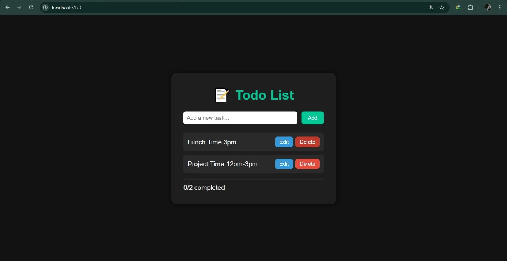
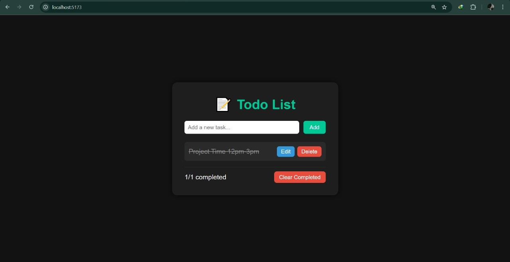

# ✅ Todo List App (React + Vite)

A simple and reusable **Todo List App** built with **React (Vite)**.  
This project demonstrates **component-based architecture**, **props passing**, and **reusable UI design** with a clean **dark theme**.  

## 🚀 Features
- Add new todos with ease ✨  
- Edit existing todos 📝  
- Delete todos ❌  
- Fully responsive dark theme 🌙  
- Styled with modern CSS 🎨  
- Component-based architecture (TodoItem, TodoList, App) ⚛️  

## 📂 Project Structure
todo-list-app/
├── src/
│ ├── components/
│ │ ├── TodoItem.jsx
│ │ ├── TodoList.jsx
│ │ └── TodoItem.css
│ ├── App.jsx
│ ├── App.css
│ └── main.jsx
├── package.json
├── vite.config.js
└── README.md

## 🛠️ Tech Stack
- **React 19**  
- **Vite 7**  
- **CSS3**  
- **GitHub Pages (Deployment)**  

## 📦 Installation & Setup
1. Clone the repository:
   git clone https://github.com/Maham2104/todo-list-app.git
   cd todo-list-app

2. Install dependencies:
    npm install

3. Start development server:
   npm run dev

4. Build for production:
   npm run build

5. Deploy to GitHub Pages:
    npm run deploy

## 🌐 Live Demo:

   Click here to view the live app:
      https://maham2104.github.io/todo-list-app/

## 📸 Screenshots

   Add screenshots of your app UI here (e.g., adding, editing, deleting todos).
      You can take screenshots, put them inside a /screenshots folder, and link them like:
          
         
         

## 🎯 Learning Outcomes

  - Understanding React component architecture
  - Applying best practices for component reuse
  - sing props for communication between components
  - Styling components with CSS
  - Deploying React apps with GitHub Pages

  
